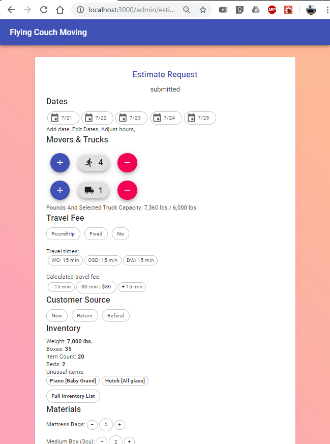
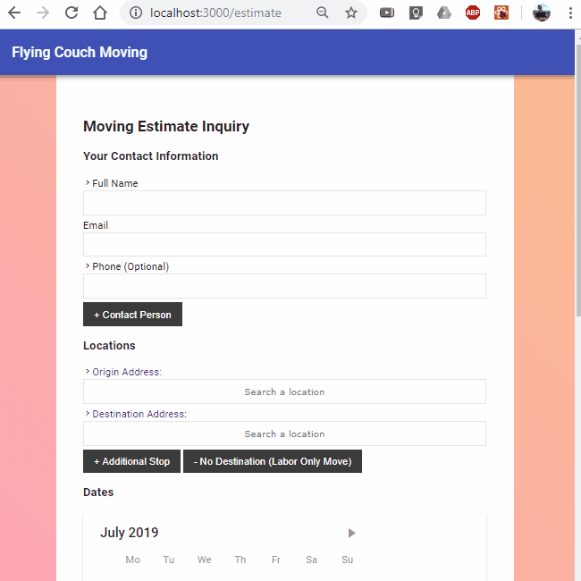
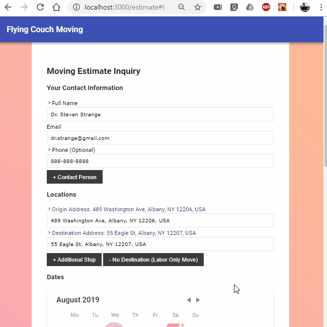

# flying-couch-moving

`npm run dev` to run server & client

Work in progress

## Api routes

## Client routes

/admin/esimates

/estimate
Parses entered name
Uses google to find and autocomplete the addresses
Parse address

Calendar multi date select,
Calendar NLP entry like "today, tomorrow, +5 (in five days), etc."

